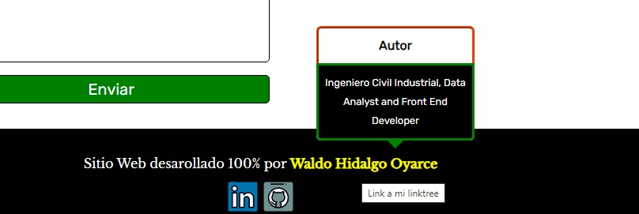

Este repositorio contiene el código con el cual he creado el proyecto número cuatro requerido por Freecodecamp para obtener la [Responsive Web Design Certification](https://www.freecodecamp.org/learn/2022/responsive-web-design/).

EL proyecto ha sido creado utilizando:

No se ha utilizado ninguna librería de componentes.

El proyecto requiere crear una Landing Page cumpliendo una serie de requisitos y tests a superar una vez creado el proyecto. Dichos requisitos y tests son los siguientes:

# Requisitos

# Tests a superar

La temática de mi proyecto es un negocio que vende paquetes de insumos de cumpleaños llamado **Easy Cumpleaños** vendidos en tres formatos: Paquete Familiar, Paquete Premium y Paquete Personalizado. Además, en mi proyecto he ido mucho más allá de lo pedido y he implementado un menú hamburguesa que despliega un menú lateral fijo desde el lado izquierdo de la pantalla. En los requisitos del proyecto se pide utilizar CSS Flexbox al menos una vez lo cual he realizado solo **una vez** y en el resto de los casos en que he necesitado posicionar elementos dentro un contenedor, he utilizado **CSS Grid**.

A continuación muestro mi proyecto en pantallas grandes, medianas y pequeñas:

## 1. Easy Cumpleaños en Pantallas Grandes:

## 2. Easy Cumpleaños en Pantallas Medianas:

## 3. Easy Cumpleaños en Pantallas Pequeñas:

El menú lateral lo he creado usando solo CSS utilizando la propiedad **transition** sobre la propiedad **left** de modo tal que la transition-timing-function es ease-in-out durando 0.5 segundos. También he agregado diferentes estilos de transición en los items del menú. Por último, he creado un tooltip personalizado usando solo CSS el cual se muestra al hacer hover sobre mi nombre ubicado en el footer:

